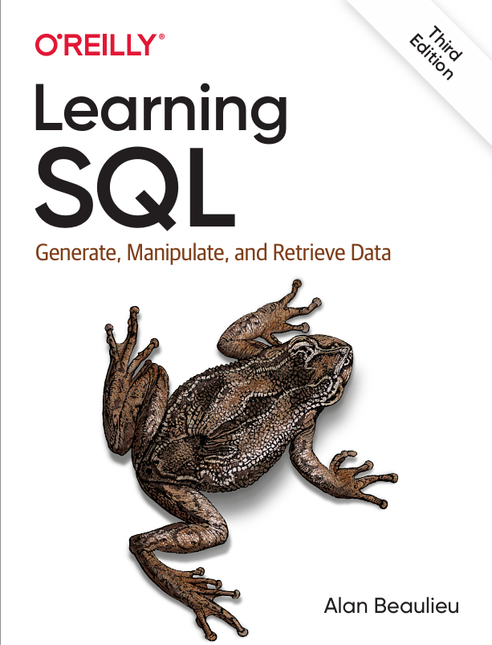

# 02-L-MySQL 🧑‍💻
Notas personales del libro LearningSQL by Alan Beaulieu.

## 📂 Notas

- [01-Creating-and-populating-a-database](01-Chapters/02-Creating-and-populating-a-database): Cómo crear una base de datos MySQL y rellenar las tablas con datos.
- [02-Query-Primer](01-Chapters/03-Query-Primer): La instrucción select y muestra con más detalle las cláusulas más comunes (select, from, where).
- [03-Filtering](01-Chapters/04-Filtering): Tipos de condiciones que se pueden utilizar en la cláusula where de una instrucción select, update o delete.
- [04-Querying-multiple-tables](01-Chapters/05-Querying-multiple-tables): Cómo las consultas pueden utilizar varias tablas a través de combinaciones de tablas.
- [05-Working-with-sets](01-Chapters/06-Working-with-sets): Conjuntos de datos y cómo pueden interactuar dentro de las consultas.
- [06-Data-generation-manipulation-and-conversion](01-Chapters/07-Data-generation-manipulation-and-conversion): Funciones integradas que se usan para manipular o convertir datos.
- [07-Grouping-and-aggregates](01-Chapters/08-Grouping-and-aggregates): Muestra cómo se pueden agregar los datos.
- [08-Subqueries](01-Chapters/09-Subqueries): Subconsultas cómo y dónde se pueden utilizar.
- [09-Joins-revisited](01-Chapters/10-Joins-revisited): Explora más a fondo los distintos tipos de combinaciones de tablas.
- [10-Conditional-logic](01-Chapters/11-Conditional-logic): Cómo utilizar la lógica condicional en instrucciones de selección, inserción, actualización y eliminación.
- [11-Indices-and-contraints](01-Chapters/13-Indices-and-contraints): Explora índices y restricciones.
- [12-Views](01-Chapters/14-Views): Muestra cómo crear una interfaz para proteger a los usuarios de las complejidades de los datos.
- [13-Analytic-functions](01-Chapters/16-Analytic-functions): Cubre funcionalidades para generar clasificaciones, subtotales y otros valores que se utilizan mucho en informes y análisis.

## 📚 Libro 

